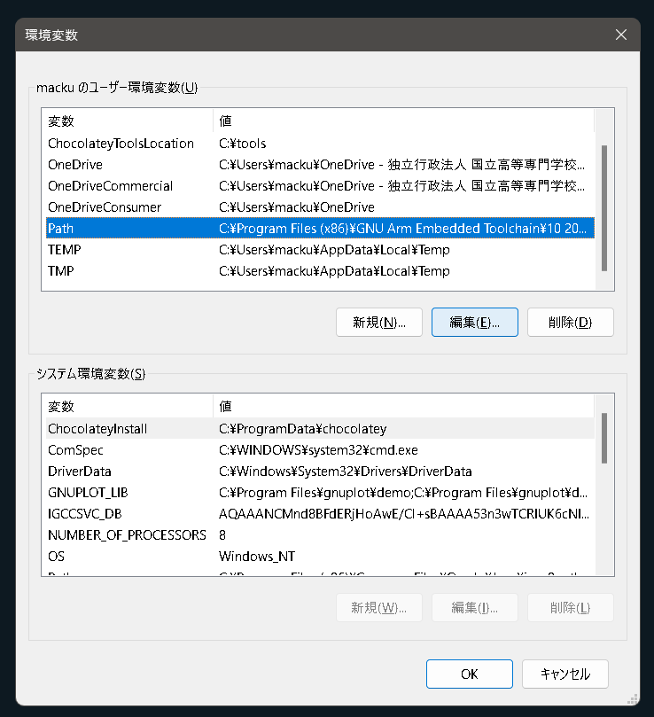
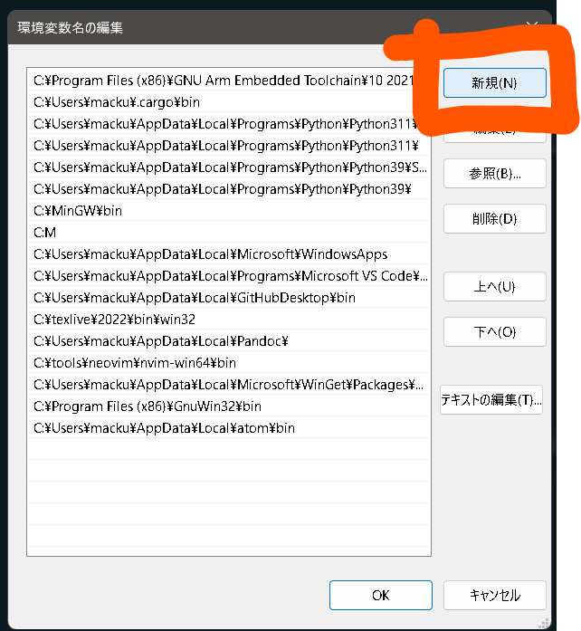

# uv とは

Python のライブラリーの管理を行うためのもの．使用するライブラリーの一覧やバージョンをテキストで管理できるため便利である．

使用する Python のバージョン自体も明示的に指定できるため，バージョン違いによって動作しなくなるといった問題を回避できる．プロジェクトごとにライブラリを管理できるため，他のプログラムに干渉することなく開発を行える．pip でインストールする場合に比べてスピードが速いため，簡単に環境を準備できる．

# uv のインストール

[公式サイト](https://github.com/astral-sh/uv)に従い uv をインストールする．あらかじめ Python などをインストールする必要はない．

## 1. Win キーを押した後に ter と入力し「ターミナル」を立ち上げる．


## 2. 次のコマンドを実行する

```powershell
# On Windows.
powershell -ExecutionPolicy ByPass -c "irm https://astral.sh/uv/install.ps1 | iex"
```

## 3. 環境パスを通す

uv のコマンドをどこからでも実行できるように uv がどこにあるかを Windows に教える必要がある．これをパスを通すと呼ぶ．ターミナルに以下を入力する．

ユーザー名はターミナルを開いたときの`PS C:\Users\`以降の文字列である．

```powershell
$env:Path = "C:\Users\ユーザー名.cargo\bin;$env:Path"
uv
```

成功していた場合は以下のような出力になる．

```powershell
 An extremely fast Python package manager.
 Usage: uv.exe [OPTIONS] <COMMAND>

 Commands:
 run Run a command or script
 init Create a new project
 add Add dependencies to the project
 ~~~他のヘルプが続く~~~

```

もし，これで Not Found などと表示され動かなかった場合には GUI で環境変数を設定する．

win キー + 環境で「環境変数を編集」を立ち上げる．


上段を少し下にスクロールし Path を選択，編集をクリックする．



新規をクリックし，ユーザー名を自分のものに変えたものをペーストする．

```
C:\Users\ユーザー名\.cargo\bin
```



## 4. インストールできたことの確認

```powershell
uv
```

をターミナルで実行しエラーがなければ次に移る．
