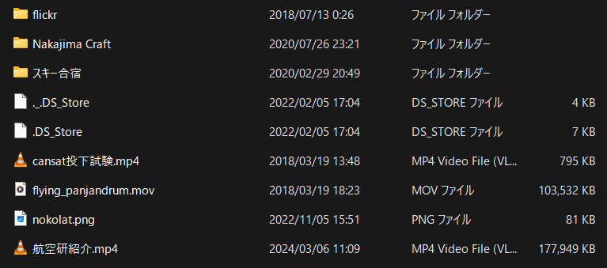

# ワークスペースの設定

## フォルダーを整える

プログラムを書くためのワークスペースを作成し必要な設定を uv でおこなう．

ターミナルで以下を実行する．作成する場所は One drive と関係ないような C drive 直下に my_programs 等の名前でファイルを作成することをおすすめする．以下の手順で実行できる．

1. ターミナルを開いた初期位置から`cd ../..`で移動して C ドライブ直下にいく
   - その時点滅するカーソルの左側は`PS C:\>`になる．
1. そこで`mkdir hoge`をしてフォルダー hoge を作成
   - 今回は my_prog を作成した．
1. `cd hoge`で hoge に移動
1. `pwd`で現在のフォルダーのパスを確認
   - `C:\hoge` のような形式になっていればよい

```shell
PS C:\Users\macku> cd ../..
PS C:\> mkdir my_prog
PS C:\> cd .\my_prog\
PS C:\my_prog> pwd

Path
----
C:\my_prog
```

フォルダーとファイルについて説明する．エクスプローラー(普段ファイル見るやつ)で確認したとき，フォルダーは下の画像でいうと「スキー合宿」や「Nakajima Craft」のことで，ファイルは「cansat 投下試験.mp4」などのことである．



    余談だが，フォルダーやファイルの名前にスペースや日本語，複数のピリオドや\ / : \* ? " < > |などの特殊文字を含めると問題が起こる可能性があるので避けるべきである．

## uv の初期設定

プログラムを書く場所ことワークスペースを整備する．

1. `uv init "hoge"`でワークスペースを初期化する．
   - この時必要なファイルが自動で作成される．
   - hoge は自分が作成したい名前にする．""は入力しない．今回は camera_test など
1. `cd "hoge"` でワークスペースに移動
1. `uv python install 3.11`で使用する python 自体のバージョンを 3.11 に固定する
1. `uv add hoge`でライブラリを追加する
   - 今回は画像処理のために openCV，RealSense の制御のために pyrealsense2 を，行列計算のために numpy を，描画のために matplotlib を追加した

```shell
uv init "hoge"
cd "hoge"

uv python install 3.11
uv add opencv-python --frozen
uv add pyrealsense2
uv add numpy
uv add matplotlib
```

uv が見つからない的なメッセージが表示されたときは

```shell
$env:PATH = "C:`\Users`\*ユーザー名*`\.local`\bin;$env:PATH"
```

をターミナルで実行する．ユーザー名は自分の名前にする．\*\*は外す

## フォーマッターの適用(やらなくてもいい)

ruff を追加し，`ruff format`でフォーマットを実行するとプログラムがきれいに整列される．人による書き方の差を吸収出来ていい．

```shell
uv add ruff
ruff --version
    #ruff 0.7.2などとバージョンが出る
ruff format
    #2 files left unchangedなどとフォーマットしたPythonファイルが表示される
```

## サンプルプログラムの実行

`uv run hoge.py`で hoge.py を実行できる．

```shell
uv run  .\programs\1\hello.py
#Using CPython 3.11.10
#Creating virtual environment at: .venv
#Hello from test! などと表示される
```
