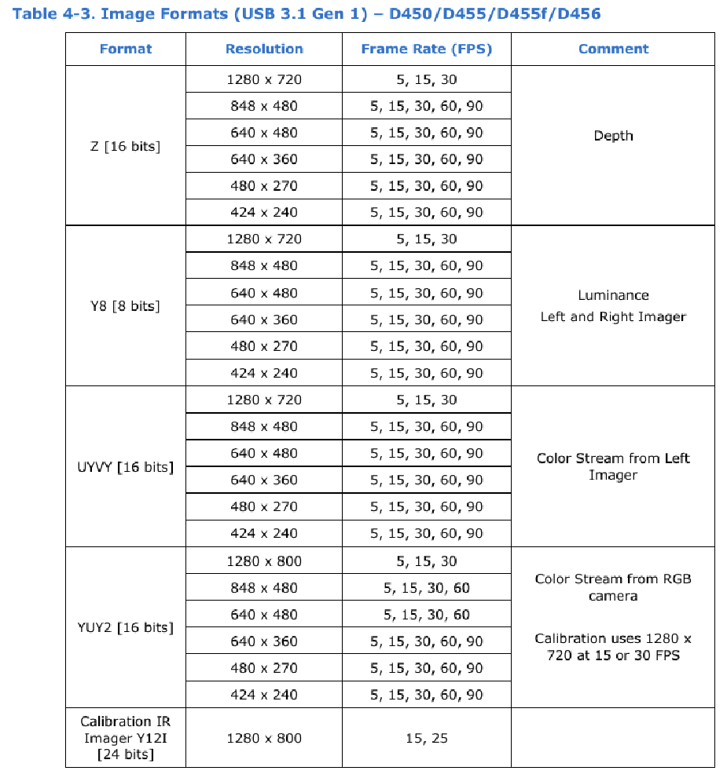

# カメラ設定の変更

## 概要

`programs/2/getIrDoubleImg.py`の主たる変更点は以下．

```python
# 起動するRealSenseのシリアル番号を指定
config.enable_device('000000000000')

# ir 画像を取得するための設定

config.disable_all_streams()
config.enable_stream(rs.stream.infrared, 1, 640, 480, rs.format.y8, 30)
config.enable_stream(rs.stream.infrared, 2, 640, 480, rs.format.y8, 30)

# レーザーをオフにする

device = pipeline.start(config).get_device()
depth_sensor = device.query_sensors()[0]
depth_sensor.set_option(rs.option.emitter_enabled, 0)
pipeline.stop()

# auto_exposure をオフにする(露出補正を固定して明るさを一定にする)

sensor = device.query_sensors()[0] # 赤外線センサーを取得
sensor.set_option(rs.option.enable_auto_exposure, 0) # 自動露出を無効にする
sensor.set_option(rs.option.exposure, 10000) # 露出を手動で設定（値は適宜調整）
```

## 詳細な内容

1. カメラの個別指定

   `config.enable_device('000000000000')`でシリアル番号を指定してカメラの設定を行う．シリアル番号はカメラの下面のシールに数字で記載されている．

   これによって複数台カメラを接続して見分ける際など役に立つ．

1. IR 画像取得のための設定

   `config.disable_all_streams()`でいったんすべて画像出力をオフにする．RGB，デプスは使わない．`config.enable_stream(rs.stream.infrared, 1or2, 640, 480, rs.format.y8, 30)`で IR のチャンネル 1 と 2 をオンにする．縦横の解像度と fps を指定する．

   fps は 1 秒間に何回画像を出力するかの値である．使用可能な解像度と fps の組み合わせは[公式のデータシート 80p](https://www.intelrealsense.com/depth-camera-d455/)参照．

   

1. IR ドットプロジェクターをオフにする

   `depth_sensor.set_option(rs.option.emitter_enabled, 0)`で IR ドットパターンを照射するのを止める．通常の使用ではこのドットパターンが距離の推定に役立つが，今回のアルゴリズムでは役に立たない．また消費電力が大きく，2 台以上接続すると UBS の電流が足りなくなるのでオフにする．

1. 露出の設定
   `sensor.set_option(rs.option.enable_auto_exposure, 0)`で自動露出補正を無効化する．これはカメラに赤外線フィルターを追加して暗くしてターゲットのみを検出しやすくするため．

   `sensor.set_option(rs.option.exposure, 10000) # 露出を手動で設定（値は適宜調整）`で明るさを固定する．場所や機体の赤外線 LED の強さに応じて都度調整する．
